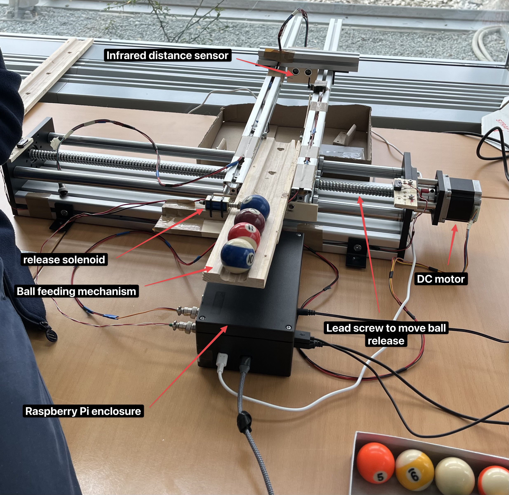
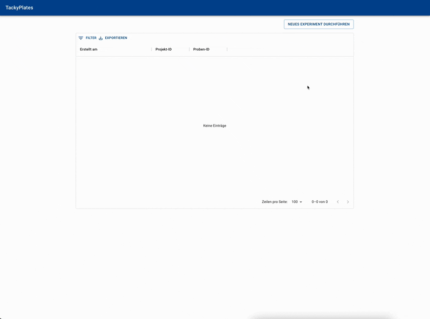

# TackyPlates - a measurement prototype built on RPI4

This is a project that was developed by [Matthias Hofmann](https://github.com/mj-hofmann) and [Wolfgang Ederer](https://github.com/wederer).
[@mj-hofmann](https://github.com/mj-hofmann) provided domain knowledge and hardware control and [Wolfgang Ederer](https://github.com/wederer) was responsible for frontend/backend and deployment.

The prototype was fully functional and used to measure how quick adhesive solutions dried out by rolling a ball onto a "tacky plate" that had the adhesive solution applied to.

## Architecture



Small billiard balls are released via a push/pull solenoid. In order for the balls to stay "on-track" a ball guide was lowered via a servo. The ball track itself was moved via a stepper motor and guided via a threaded spindle. How far the ball travelled was measured via a ultrasonic distance sensor (HC-SR04). Each measurement was written into the sqlite3 database.

## Demo of UI



## How to run locally with simulated hardware

```bash
# in frontend folder:
npm run dev

# in backend folder:
make migrate # runs database migrations to setup structure
make runserver-mocked # starts backend with mocked hardware

# Access localhost:3000 via browser
```

## Technologies
**Frontend**:
- React
- TypeScript
- Redux Toolkit Query
- OpenAPI Codegen (openapi-typescript-codegen)
- Material UI
- Recharts
- Yarn
 
*Reasoning:*

React is my framework of choice for the frontend and TypeScript is a "no-brainer" even for smaller teams, as JS is more bug-prone. Redux Toolkit Query was used as I did not want to duplicate interface/types from backend to the frontend and together with openapi-typescript-codegen I could generate all frontend code to query the Rest API via hooks. Material UI is a solid component library and Recharts is great for simple charting.


**Backend:**
- Python
- Django
- Django Ninja
- apscheduler
- sqlite3
- poetry/pip and venv

*Reasoning:*

The hardware access for the Raspberry Pi was done with Python and thus the backend was also written in Python to keep it simple. Django was used as it provides a solid foundation (database migrations, ORM, etc.) and enough abstraction to keep the scope of the project manageable. Django Ninja was used to easily build a REST API on top of django. pip + venv was used for dependency management. Poetry always ran into issues on the Raspberry Pi and was discarded at some point during the project. Sqlite3 was chosen as a database, as it is very simple and easy to prototype with and database performance was not an issue.


**"Deployment" on Raspberry Pi:**
- Monit
- Nginx
- gunicorn
- ~~Docker~~

*Reasoning:*

nginx was used to host the frontend on the RPI and gunicorn to run the backend. By requiring the gunicorn socket in the nginx frontend configuration the backend was always started in conjunction with the frontend. In order to keep the services running monit was used to continously monitor frontend and backend status and restart on errors. Docker was discarded after some trial and error as it was cumbersome to work with on the Raspberry Pi and simply pulling code changes and rebuilding was deemed good enough. A more sophisticated update machanism had not been implemented yet.


## Programming Style
As the project was a prototype a lot of code would have to be refactored before production use. In the frontend a lot of unnecessary `useEffect` hooks are used where simple functions would be better. In addition a lot of components have gotten very big and would have to be split before testing is feasible.
The backend is relatively messy, as this was my (@wederer) first time working with django and djano-ninja. Especialy the threading/async portions could use some work.
